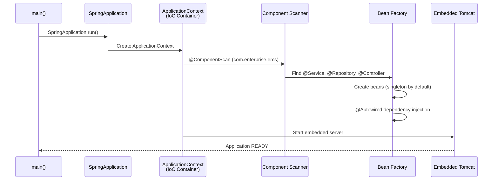
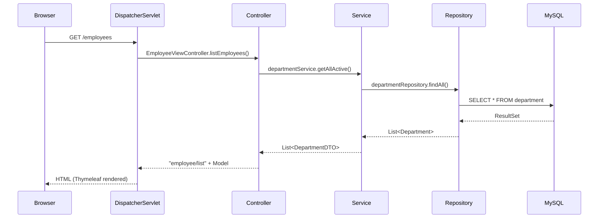
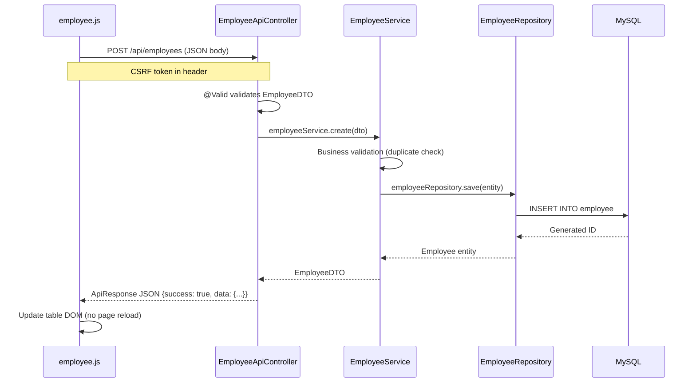
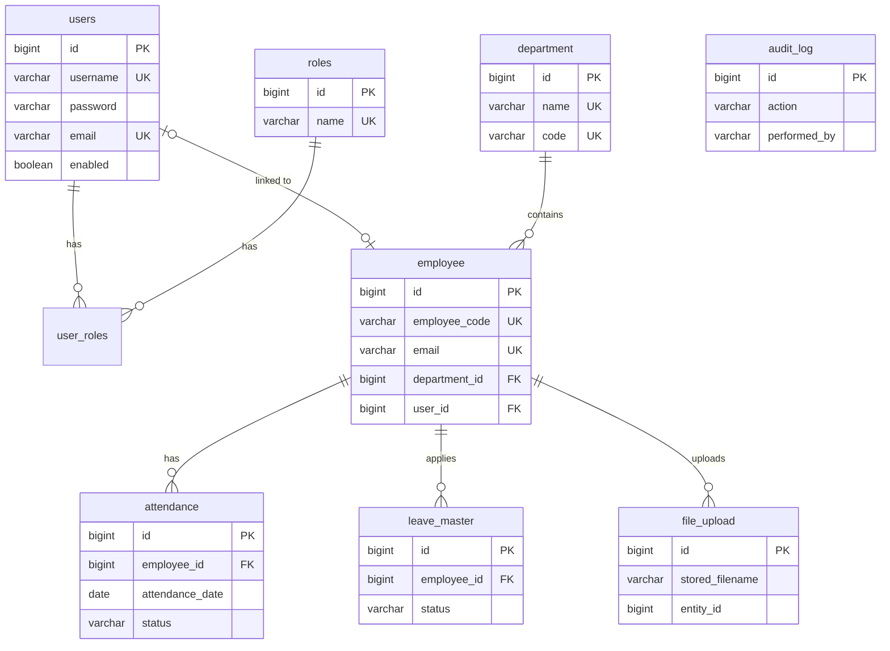
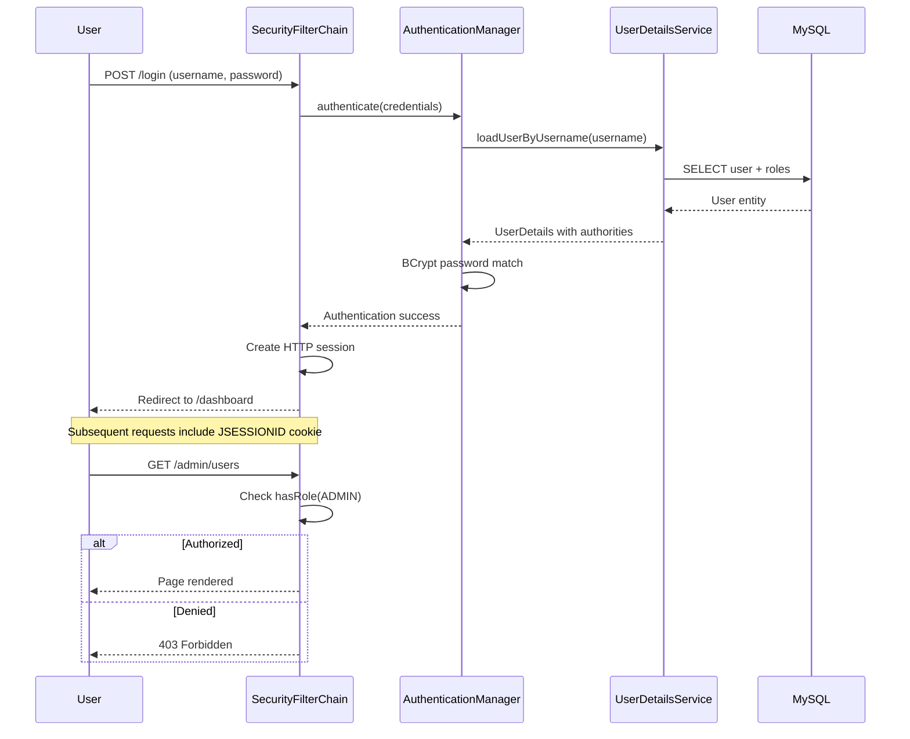

# Complete Learning Guide — Enterprise Employee Management System

> **Purpose:** This document is your primary study material. It can be exported to PDF for offline reference.

---

## 1. Project Overview

**EEMS** is a production-style Spring Boot application that demonstrates every major concept required for a 2–5 year Spring Boot developer role.

**What you will learn by building and reading this project:**

- How Spring Boot starts and creates beans (IoC)
- How HTTP requests flow through MVC layers
- How JPA/Hibernate maps Java objects to MySQL tables
- How Spring Security protects pages and APIs
- How AJAX calls REST endpoints without page reload
- How validation works on frontend and backend
- How to handle errors globally
- How caching, scheduling, and async processing work
- How to test and deploy to Tomcat

---

## 2. Architecture Diagram

```mermaid
graph TB
    subgraph Client
        Browser[Browser]
        AJAX[jQuery AJAX]
    end

    subgraph SpringBoot["Spring Boot Application"]
        subgraph Presentation
            MVC[MVC Controllers<br/>Thymeleaf Views]
            REST[REST Controllers<br/>JSON APIs]
        end

        subgraph Business
            Service[Service Layer<br/>Business Logic]
            Cache[Caffeine Cache]
        end

        subgraph Data
            Repo[Repository Layer<br/>Spring Data JPA]
            Entity[JPA Entities]
        end

        subgraph CrossCutting
            Security[Spring Security]
            Exception[@ControllerAdvice]
            Scheduler[@Scheduled]
            Async[@Async]
            Audit[Audit Service]
        end
    end

    DB[(MySQL Database)]

    Browser --> MVC
    AJAX --> REST
    MVC --> Service
    REST --> Service
    Service --> Cache
    Service --> Repo
    Repo --> Entity
    Entity --> DB
    Security -.-> MVC
    Security -.-> REST
    Exception -.-> REST
    Service --> Async
    Scheduler --> Service
```

---

## 3. Package Structure Explained

| Package | Purpose | Example Class |
|---------|---------|---------------|
| `config` | `@Configuration` beans, app setup | `SecurityConfig`, `CacheConfig` |
| `controller` | MVC — returns HTML view names | `DashboardController` |
| `controller.api` | REST — returns JSON | `EmployeeApiController` |
| `service` | Business logic interfaces | `EmployeeService` |
| `service.impl` | Service implementations | `EmployeeServiceImpl` |
| `repository` | Database access (JPA) | `EmployeeRepository` |
| `entity` | Database table mapping | `Employee` |
| `dto` | API/UI data contracts | `EmployeeDTO` |
| `mapper` | Entity ↔ DTO conversion | `EmployeeMapper` |
| `exception` | Custom errors + global handler | `GlobalExceptionHandler` |
| `security` | Authentication & authorization | `SecurityConfig` |
| `scheduler` | Cron/fixed-rate jobs | `ReportScheduler` |
| `constant` | Magic string elimination | `AppConstants` |

**Why separate controller and controller.api?**
- MVC controllers serve HTML to browsers
- REST controllers serve JSON to AJAX/mobile/Postman
- Same service layer serves both — **DRY principle**

---

## 4. Spring Boot Startup Flow



### IoC Container (Inversion of Control)

**Before Spring (your Servlet days):**
```java
EmployeeService service = new EmployeeServiceImpl(); // YOU create objects
```

**With Spring:**
```java
@Autowired
private EmployeeService employeeService; // SPRING creates and injects
```

Spring's `ApplicationContext` is the IoC container — it creates objects, wires dependencies, and manages lifecycle.

### Bean Lifecycle

1. **Instantiation** — Constructor called
2. **Dependency Injection** — `@Autowired` fields set
3. **Post-processing** — `@PostConstruct` methods run
4. **Bean Ready** — Available for use
5. **Shutdown** — `@PreDestroy` on context close

### Bean Scopes

| Scope | Annotation | Behavior |
|-------|-----------|----------|
| Singleton | Default | One instance per container |
| Prototype | `@Scope("prototype")` | New instance every injection |

**Interview tip:** Spring beans are singleton by default. Prototype is used when each request needs its own object (rare in services).

---

## 5. MVC Request Flow



---

## 6. AJAX + REST Flow (Employee CRUD)



---

## 7. Database Design (ER Diagram)



### Why Each Table Exists

| Table | Reason |
|-------|--------|
| `users` | Login credentials — separate from HR data |
| `roles` | RBAC permission definitions |
| `user_roles` | Many-to-many: user can have multiple roles |
| `department` | Organizational grouping |
| `employee` | Core HR record |
| `attendance` | Daily presence tracking |
| `leave_master` | Leave workflow with approval |
| `file_upload` | File metadata (files on disk) |
| `audit_log` | Who did what, when — compliance |

---

## 8. Security Flow



---

## 9. Validation Strategy

| Layer | Mechanism | Example |
|-------|-----------|---------|
| Frontend HTML5 | `required`, `pattern` | Mobile: `[6-9][0-9]{9}` |
| Frontend JS | `form.checkValidity()` | Before AJAX submit |
| Backend DTO | `@NotBlank`, `@Email`, `@Pattern` | EmployeeDTO fields |
| Backend Service | Business rules | Duplicate email check |

**Why validate on both frontend and backend?**
Frontend validation improves UX (instant feedback). Backend validation is **mandatory** — frontend can be bypassed via Postman/curl.

---

## 10. Exception Handling Flow

```
Service throws ResourceNotFoundException
    ↓
Controller does NOT catch it (propagates up)
    ↓
GlobalExceptionHandler.@ExceptionHandler catches it
    ↓
Returns JSON ApiResponse (for /api/*) OR error page (for MVC)
```

---

## 11. Caching Flow

```
First call: employeeService.getById(1)
    → Cache MISS → DB query → store in Caffeine cache

Second call: employeeService.getById(1)
    → Cache HIT → return cached value (no DB query)

After update: @CacheEvict clears cache
    → Next read goes to DB again
```

---

## 12. Best Practices Demonstrated

1. **Layered architecture** — Controller → Service → Repository
2. **DTO pattern** — Never expose entities to API/UI
3. **Soft delete** — `active=false` instead of DELETE
4. **Global exception handling** — Consistent error responses
5. **CSRF protection** — AJAX sends CSRF token
6. **Role-based access** — `@PreAuthorize`, URL patterns
7. **Audit logging** — Async, non-blocking
8. **Open-in-view disabled** — Prevents lazy loading issues
9. **BCrypt passwords** — Never store plain text
10. **Pagination** — Never return unbounded lists

---

## 13. Common Mistakes to Avoid

| Mistake | Correct Approach |
|---------|-----------------|
| `@Autowired` on entity fields | Use constructor injection (`@RequiredArgsConstructor`) |
| Returning Entity from REST API | Return DTO |
| `ddl-auto=create` in production | Use `validate` + Flyway/Liquibase |
| Catching exceptions in every controller | Use `@ControllerAdvice` |
| No CSRF token in AJAX POST | Read from Thymeleaf meta tags |
| `open-in-view=true` for REST | Set `false` in properties |
| Hardcoded SQL in service | Use Spring Data JPA repositories |
| `@Transactional` on controller | Put on service layer only |

---

*Continue to PHASES.md for step-by-step learning order and ANNOTATION_REFERENCE.md for every annotation.*
